# Datasets - Cheat Sheet (Updated with Thumbnails)

Scope: datasets that appear across CAMELTrack, MOTIP, ReST, MCBLT, and One Graph.

---

## Why dataset choice matters

These five papers are **not** evaluating exactly the same problem.

Some datasets mainly stress:
- single-view association quality
- cross-view identity matching
- long-term occlusion recovery
- 3D / ground-plane reasoning
- scene-aware tracking under structural occlusion

So the dataset is part of the method story, not just a benchmark name.

## Quick taxonomy

| Family | Datasets | What they mainly test | Papers |
|---|---|---|---|
| Single-view 2D MOT | DanceTrack, SportsMOT, MOT17, MOT20, BFT, PoseTrack21, BEE24 | association under motion, crowding, appearance ambiguity, or unusual object categories | CAMELTrack, MOTIP, One Graph |
| Classic multi-camera / MTMC | WildTrack, CAMPUS, PETS-09 | cross-view matching, calibration-aware reasoning, recovery across views | ReST, MCBLT, One Graph |
| Large-scale 3D / scene-aware | AICity'24, SCOUT | long-horizon MTMC, 3D localization, scene priors, structural occlusion | MCBLT, One Graph |

## Single-view 2D MOT

### DanceTrack

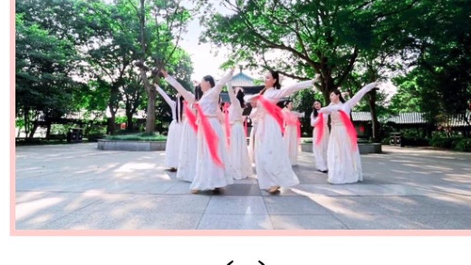

- **What is in it:** Group-dance videos with highly similar appearance, diverse motion, and frequent articulation.
- **Main challenge:** Association when appearance is weak and motion matters more.
- **Used by:** CAMELTrack, MOTIP
- **Why it matters in this reading set:** A strong result here usually means the method is genuinely good at matching identities through motion.
- **Source note:** Official project page for stats and sample imagery. [DanceTrack project page](https://dancetrack.github.io/)

### SportsMOT

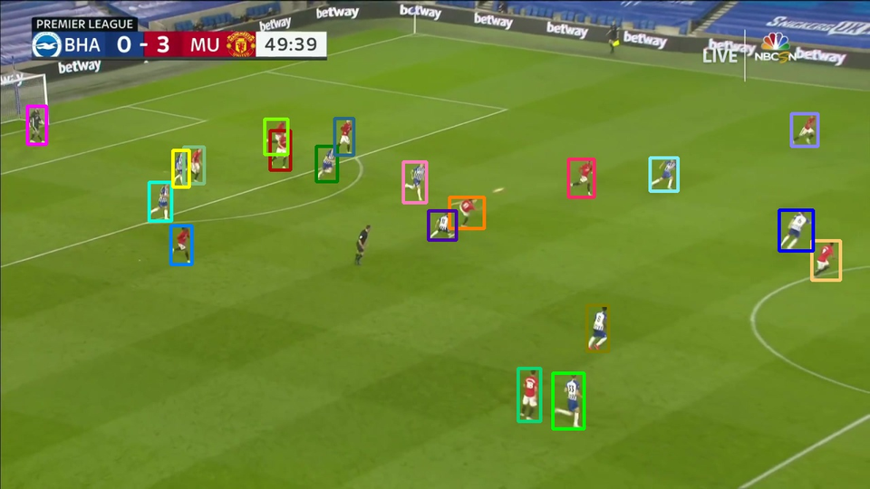

- **What is in it:** Broadcast sports clips covering basketball, football, and volleyball players on the court.
- **Main challenge:** Fast camera motion, similar uniforms, abrupt re-entry, and sports-specific movement.
- **Used by:** CAMELTrack, MOTIP
- **Why it matters in this reading set:** Useful for checking whether association logic survives camera pans and near-identical team appearance.
- **Source note:** Official SportsMOT dataset page for stats and sample imagery. [SportsMOT dataset page](https://deeperaction.github.io/datasets/sportsmot.html)

### MOT17

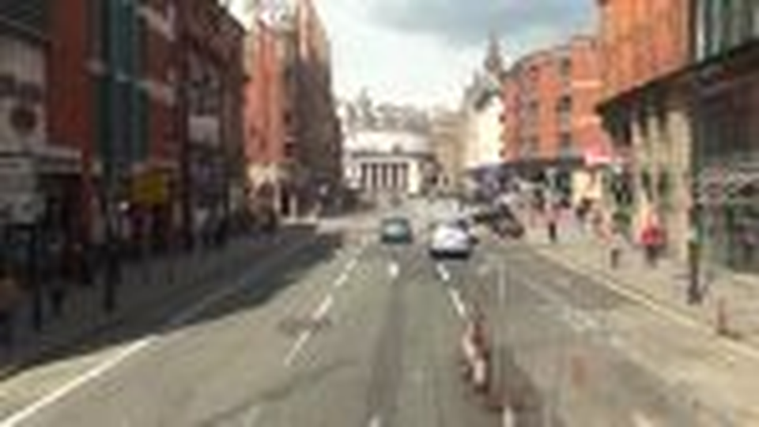

- **What is in it:** Classic pedestrian tracking benchmark derived from MOT16 with improved ground truth and multiple detector sets.
- **Main challenge:** Crowded street scenes, moving cameras, benchmark legacy, and detector sensitivity.
- **Used by:** CAMELTrack, One Graph
- **Why it matters in this reading set:** Still the default reference point for whether a tracker is competitive on mainstream pedestrian MOT.
- **Source note:** Official MOTChallenge page for benchmark description and sample frame. [MOT17 benchmark page](https://motchallenge.net/data/MOT17/)

### MOT20

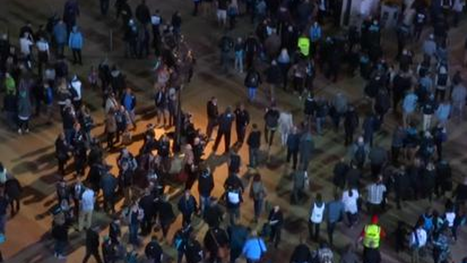

- **What is in it:** Pedestrian MOT benchmark focused on extremely crowded scenes.
- **Main challenge:** Severe crowd density, frequent occlusions, and identity ambiguity.
- **Used by:** One Graph
- **Why it matters in this reading set:** If a method holds up here, it usually has strong crowd handling and long-occlusion recovery.
- **Source note:** Official MOTChallenge page for benchmark description and sample frame. [MOT20 benchmark page](https://motchallenge.net/data/MOT20/)

### BFT

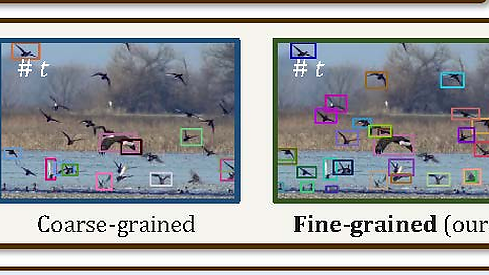

- **What is in it:** Bird-flock tracking dataset spanning many species and open-world scenes.
- **Main challenge:** Highly dynamic non-rigid motion, scale change, and near-uniform appearance.
- **Used by:** MOTIP
- **Why it matters in this reading set:** Shows whether a tracker transfers beyond human pedestrians to fast, deformable open-world targets.
- **Source note:** NetTrack / BFT project page for dataset description; thumbnail from a representative project figure. [NetTrack project page](https://george-zhuang.github.io/nettrack/)

### PoseTrack21

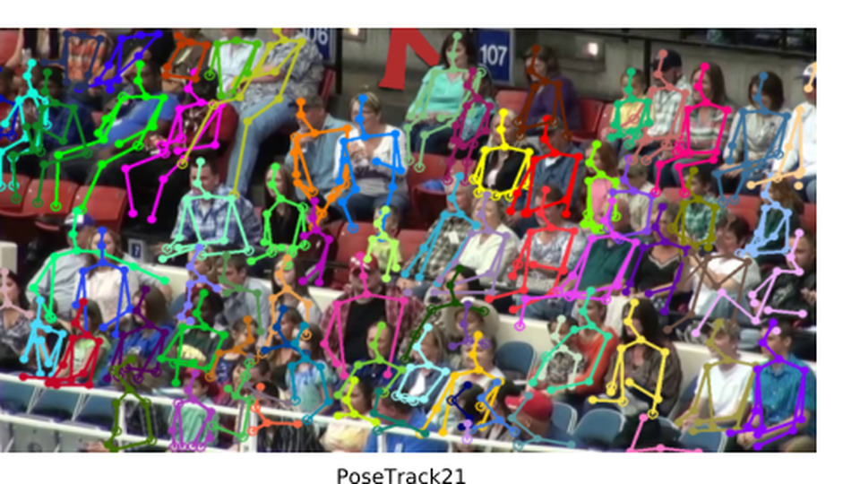

- **What is in it:** Joint benchmark for person search, multi-object tracking, and multi-person pose tracking.
- **Main challenge:** Articulated motion, dense human pose annotation, and severe occlusion.
- **Used by:** CAMELTrack
- **Why it matters in this reading set:** Useful for seeing whether an association method also helps pose-centric human tracking.
- **Source note:** Official PoseTrack21 paper / project repository; thumbnail cropped from the official CVPR paper figure. [PoseTrack21 paper](https://openaccess.thecvf.com/content/CVPR2022/papers/Doring_PoseTrack21_A_Dataset_for_Person_Search_Multi-Object_Tracking_and_Multi-Person_CVPR_2022_paper.pdf); [PoseTrack21 repository](https://github.com/anDoer/PoseTrack21)

### BEE24

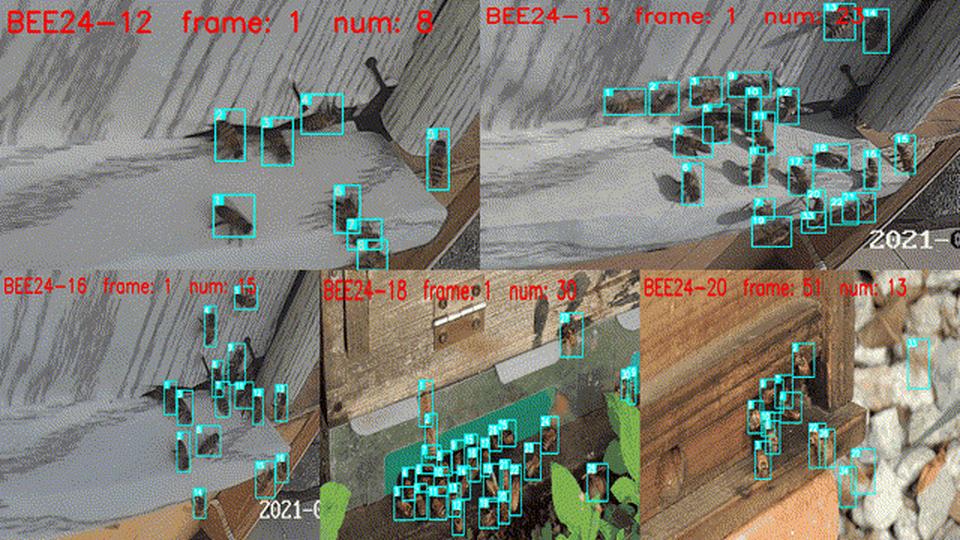

- **What is in it:** Small-object MOT benchmark built to emphasize complex motions and diverse scenes.
- **Main challenge:** Tiny objects, long sequences, appearance similarity, and motion complexity.
- **Used by:** CAMELTrack
- **Why it matters in this reading set:** Good stress test for whether association is still reliable when detections are tiny and motion is irregular.
- **Source note:** Official dataset page for description and animated sample frame. [BEE24 dataset page](https://holmescao.github.io/datasets/BEE24)

## Classic Multi-Camera / MTMC

### WildTrack

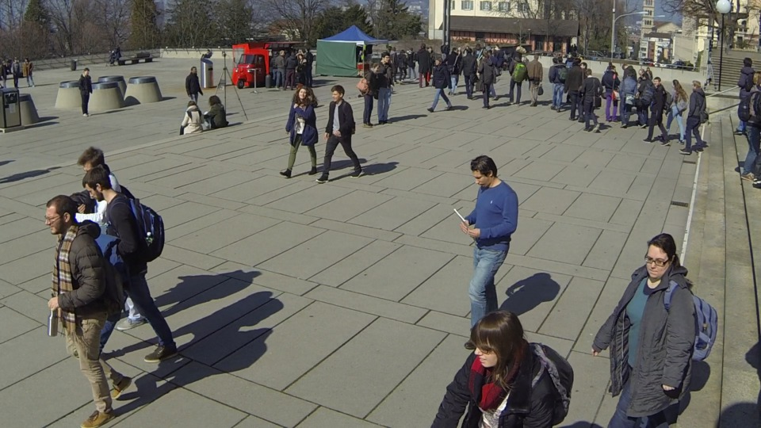

- **What is in it:** Seven synchronized HD cameras with overlapping views over a shared outdoor pedestrian space.
- **Main challenge:** Cross-view association, calibration-aware reasoning, and ground-plane localization.
- **Used by:** ReST, MCBLT, One Graph
- **Why it matters in this reading set:** This is the cleanest bridge from 2D single-view tracking to multi-camera reasoning with shared geometry.
- **Source note:** Official EPFL WildTrack page for description and sample imagery. [WildTrack dataset page](https://www.epfl.ch/labs/cvlab/data/data-wildtrack/)

### CAMPUS

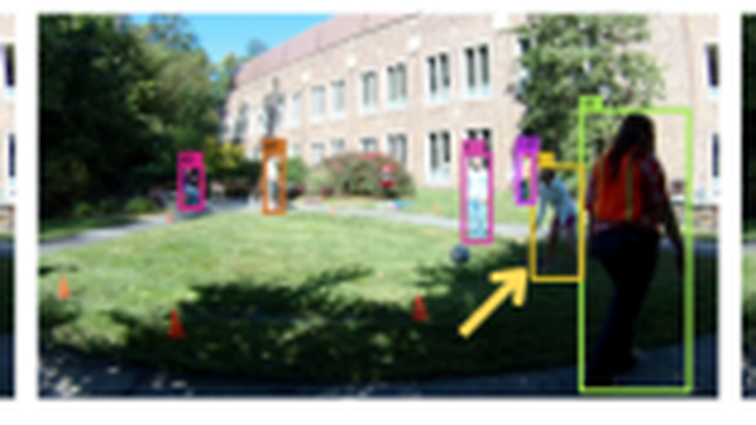

- **What is in it:** Classic small-scale multi-camera pedestrian scene used in older MTMC literature.
- **Main challenge:** Partial overlap, view-to-view identity matching, and long-term consistency across cameras.
- **Used by:** ReST
- **Why it matters in this reading set:** Good for reading older graph / association design choices without the engineering overhead of newer large datasets.
- **Source note:** Thumbnail cropped from the qualitative CAMPUS figure in the uploaded ReST paper.

### PETS-09

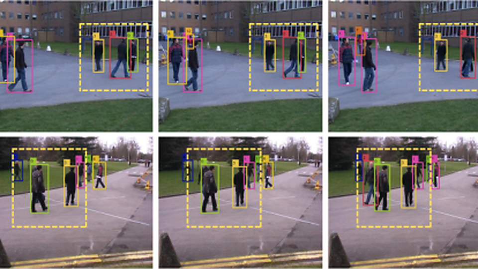

- **What is in it:** Legacy surveillance multi-camera benchmark with overlapping views.
- **Main challenge:** Cross-view consistency, occlusion recovery, and MTMC evaluation on an older benchmark family.
- **Used by:** ReST
- **Why it matters in this reading set:** Still useful as a historical reference point for how modern MTMC methods compare to earlier settings.
- **Source note:** Thumbnail cropped from the qualitative PETS09 figure in the uploaded ReST paper.

## Large-Scale 3D / Scene-Aware

### AICity'24

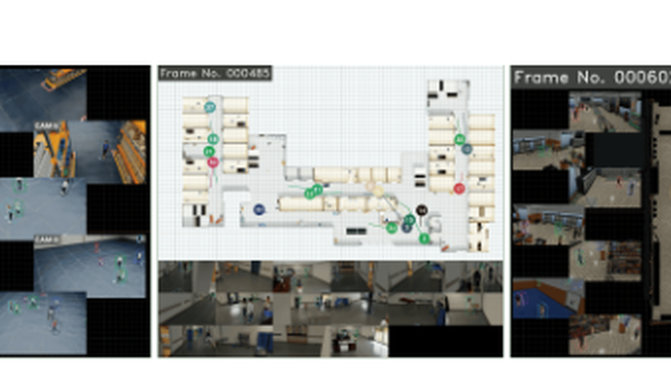

- **What is in it:** Large synthetic indoor multi-camera people-tracking benchmark with 3D annotations and camera geometry.
- **Main challenge:** Long-horizon MTMC, severe occlusion, 2D-3D consistency, and long videos.
- **Used by:** MCBLT
- **Why it matters in this reading set:** This is where long-video MTMC methods have to prove they can maintain identity over time, not just frame to frame.
- **Source note:** Official AI City Challenge track page for public benchmark description; thumbnail cropped from the uploaded MCBLT paper. [AI City Challenge 2024 tracks](https://www.aicitychallenge.org/2024-challenge-tracks/)

### SCOUT

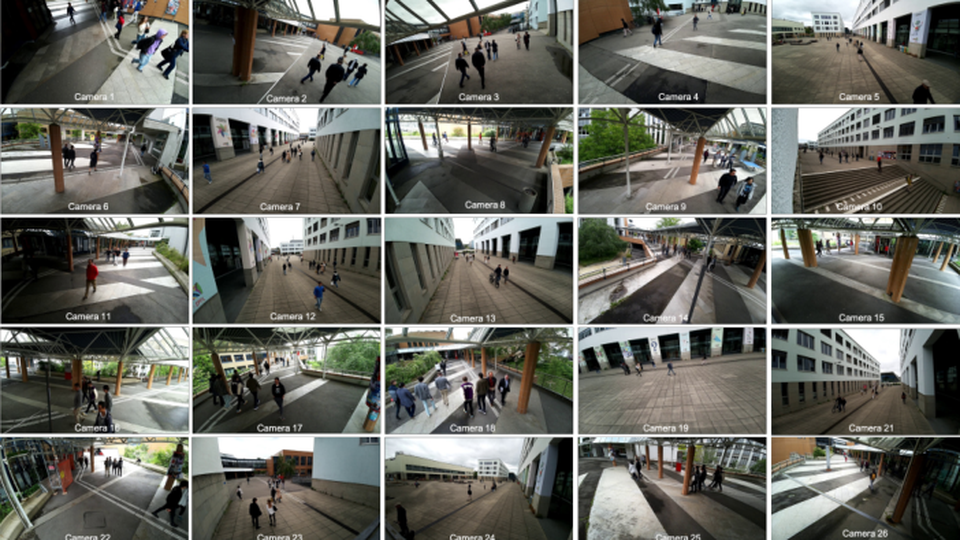

- **What is in it:** Large-scale multi-camera pedestrian dataset with calibration, 3D scene structure, and realistic outdoor occlusions.
- **Main challenge:** Structural occlusions from the scene, scene-aware reasoning, and unified single-view / multi-view tracking.
- **Used by:** One Graph
- **Why it matters in this reading set:** Important because it rewards trackers that actually understand scene layout rather than only image similarity.
- **Source note:** Official Scout toolkit / project material for benchmark description; thumbnail cropped from the uploaded One Graph paper. [SCOUT dataset page](https://scout.epfl.ch/); [SCOUT toolkit](https://github.com/cvlab-epfl/scout_toolkit)

## Practical reading guide

- **Best for association quality:** DanceTrack, SportsMOT
- **Best for classic pedestrian MOT reference:** MOT17, MOT20
- **Best for transfer beyond standard pedestrian street scenes:** BFT, PoseTrack21, BEE24
- **Best for overlapping multi-camera tracking:** WildTrack, CAMPUS, PETS-09
- **Best for geometry-rich, long-horizon MTMC:** AICity'24, SCOUT

## One-sentence takeaway

Across these papers, the benchmarks move from **single-view 2D association** toward **geometry-rich, long-horizon multi-camera tracking** where 3D structure and scene context matter much more.