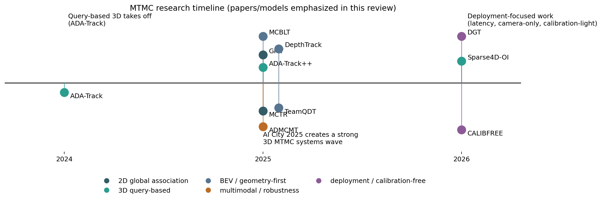
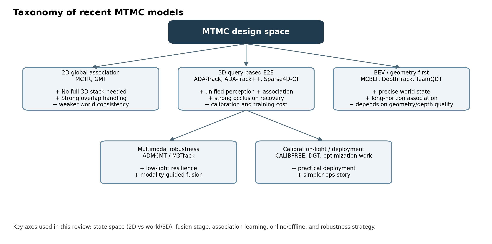
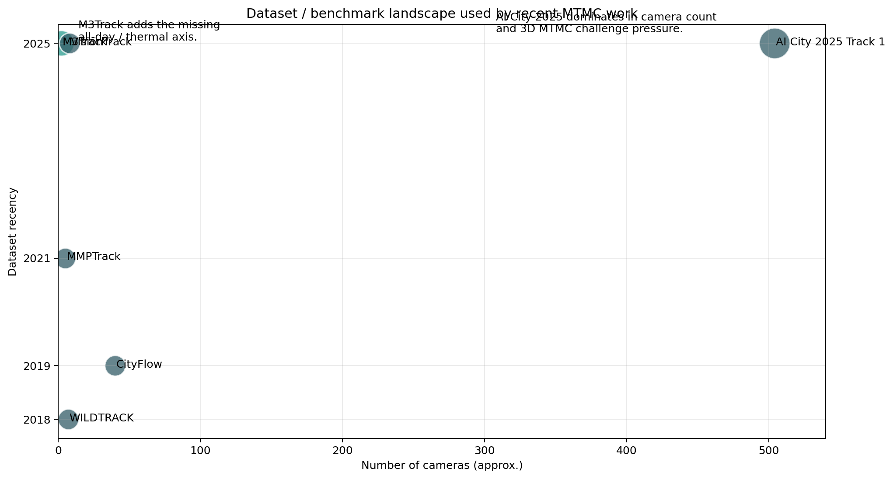
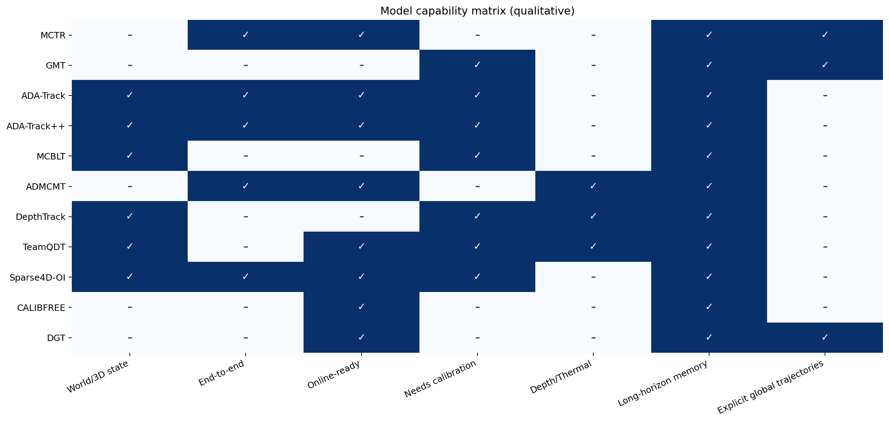
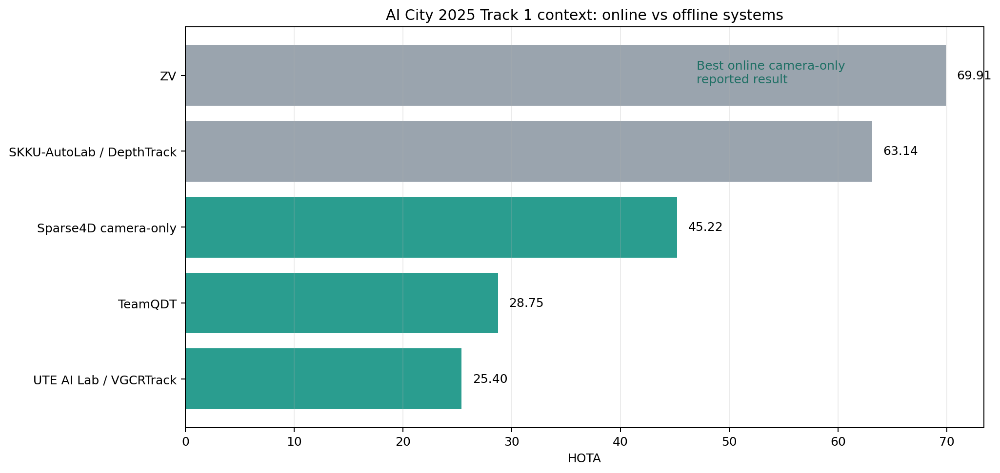
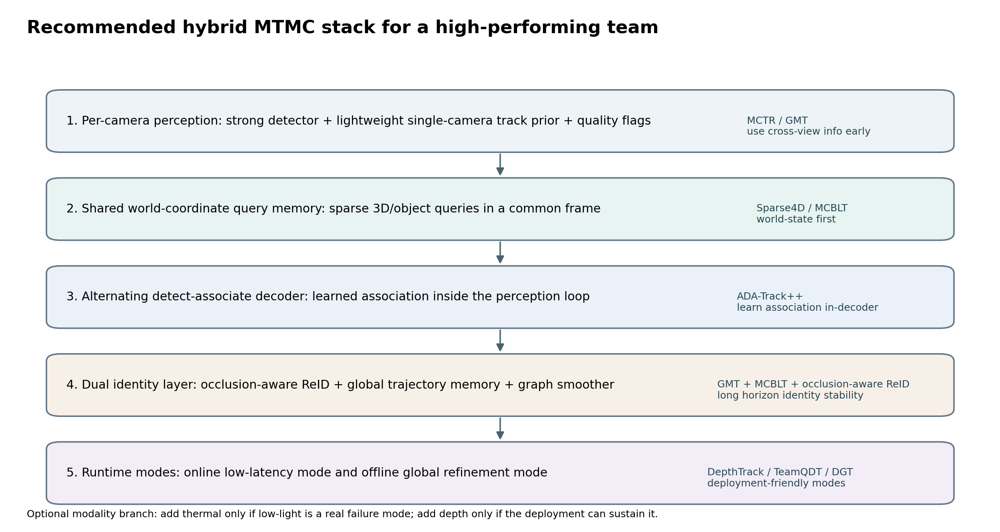

# Latest MTMC (Multi-object Tracking Multi-camera) models and papers

**Prepared:** 2026-03-12  
**Scope:** public papers, challenge reports, and notable preprints available up to 2026-03-12.  
**Important caveat:** scores across datasets are *not directly comparable*. The comparison below emphasizes model ideas, assumptions, and deployment trade-offs more than raw leaderboard values.

[Online presentation viewer](https://view.officeapps.live.com/op/view.aspx?src=https://raw.githubusercontent.com/chanyoungs/superbai-3dvision-papers/main/mtmc/exploration/presentation.pptx)

## Executive summary

The center of gravity in MTMC has shifted in three directions:

1. **From heuristic late association to learned global association.** MCTR and GMT explicitly model multi-camera identity reasoning rather than treating cross-camera matching as a small post-processing stage.
2. **From 2D track stitching to world-coordinate / 3D reasoning.** ADA-Track, ADA-Track++, MCBLT, DepthTrack, TeamQDT, and outside-in Sparse4D variants all show that a common 3D state reduces cross-view ambiguity.
3. **From benchmark-only accuracy to deployable systems.** 2025–2026 work increasingly studies online operation, camera-only inference, low FPS, low light, calibration-light setups, and latency/FPS constraints.

My bottom-line recommendation for an MTMC team is:

- **Use a world-coordinate query memory as the core representation.**
- **Learn association inside the perception loop** (ADA-Track++ style), not only after detection.
- **Keep a second, slower global trajectory memory/smoother** (GMT/MCBLT style) for long-horizon identity cleanup.
- **Add robustness modules only for real failure modes**: thermal for low light, depth for world grounding, calibration-free embedding learning when calibration is weak.

## 1) What changed recently

Recent MTMC work is no longer one monolithic pipeline. It is splitting into a few strong families:

### My reading of the landscape

- **If cameras overlap strongly and you want a relatively simple stack**, MCTR/GMT-style global association is attractive.
- **If you need the best long-term cross-view consistency**, a shared 3D/world state is increasingly the dominant pattern.
- **If your deployment is indoor infrastructure (warehouse, retail, hospital)**, outside-in 3D perception is becoming the most relevant formulation.
- **If lighting is a major failure mode**, the all-day multimodal story in ADMCMT is more important than marginal benchmark gains on daylight-only datasets.
- **If ops complexity matters**, DGT / calibration-light work matters more than raw SOTA tables.

## 2) Dataset and benchmark landscape

| Dataset              |   Year | Domain                                |   Cameras |   Approx. frames (k) | Modalities                          | Notes                                                                            |
|:---------------------|-------:|:--------------------------------------|----------:|---------------------:|:------------------------------------|:---------------------------------------------------------------------------------|
| WILDTRACK            |   2018 | pedestrians / outdoor                 |         7 |                  0.4 | RGB                                 | Highly calibrated, overlapping, 2 FPS, ~56K view boxes over 400 annotated frames |
| CityFlow             |   2019 | vehicles / city-scale                 |        40 |                nan   | RGB                                 | >3 hours, 40 cameras, 10 intersections, >200K boxes; geometry provided           |
| MMPTrack             |   2021 | people / indoor                       |       nan |                nan   | RGB(+RGBD labeling)                 | Five environments: industry, retail, cafe, lobby, office; dense labels           |
| M3Track              |   2025 | people / UAV / all-day                |         2 |                236   | RGB+Thermal                         | 19 scenes, 118Kx2 frames, 1.188M boxes, low-light and moving cameras             |
| VisionTrack          |   2025 | pedestrians                           |       nan |                nan   | RGB                                 | Introduced with GMT; positioned as higher-diversity MCMT dataset                 |
| AI City 2025 Track 1 |   2025 | people + robots / synthetic indoor 3D |       504 |                nan   | RGB + GT depth in challenge package | 42 hours, 504 cameras, 19 indoor layouts, >360 object instances                  |

### Practical interpretation

- **WILDTRACK** is still valuable for calibrated overlapping pedestrian scenes, but it is small and low-FPS.
- **CityFlow** remains important for non-overlapping vehicle MTMC and large camera networks.
- **MMPTrack** is a strong indoor people benchmark and helped expose occlusion-heavy retail failures.
- **M3Track** is the big new dataset contribution for all-day / low-light / RGBT MTMC.
- **AI City 2025 Track 1** is the most important recent forcing function for 3D MTMC in structured indoor spaces.

## 3) Paper-by-paper survey

### A. 2D global association family

#### MCTR (2025 workshop / 2024 arXiv)
**Core idea.** Turn DETR-style end-to-end MOT into multi-camera tracking by adding a learned tracking module and a learned association module.  
**Why it matters.** It is one of the clearest demonstrations that multi-camera tracking can be learned end-to-end instead of built from many hand-tuned stages.  
**Best use case.** Overlapping cameras, RGB only, team wants to avoid heavy calibration dependence.  
**Main limitation.** Still weaker on long-horizon identity consistency than heavily engineered offline systems.

#### GMT (2025 arXiv v2)
**Core idea.** Stop treating each camera’s trajectory as primary. Build **global trajectories** spanning multiple views, then associate new detections directly to those global trajectories.  
**Why it matters.** Conceptually, this is one of the cleanest upgrades over classic single-camera-then-cluster pipelines.  
**Best use case.** Overlapping cameras where explicit cross-view trajectory objects are natural.  
**Main limitation.** Less clearly packaged as a full deployment system than the 2025 challenge stacks.

### B. Query-based 3D end-to-end family

#### ADA-Track (CVPR 2024)
**Core idea.** Alternate detection and association in the decoder instead of forcing one shared query embedding to do everything at once.  
**Why it matters.** It bridges the gap between tracking-by-attention and tracking-by-detection.  
**Best use case.** Teams comfortable with DETR-style multi-view 3D detection and wanting a principled, learned association design.

#### ADA-Track++ (2025 preprint)
**Core idea.** Improve ADA-Track’s association with edge-augmented cross-attention and an auxiliary token that reduces confusing attention normalization effects.  
**Why it matters.** It strengthens the argument that **association should be a first-class learned module inside the decoder**.  
**Best use case.** The same settings as ADA-Track, but especially when association quality is the current bottleneck.

#### Outside-in Sparse4D adaptation (2026)
**Core idea.** Re-purpose Sparse4D-style query memory for fixed camera networks observing a shared space from the outside-in, with occlusion-aware ReID and Sim2Real augmentation.  
**Why it matters.** This is a strong sign that the object-query + temporal-memory paradigm transfers beyond autonomous driving.  
**Best use case.** Large indoor camera networks where camera-only inference matters.

### C. Geometry-first / BEV / challenge-system family

#### MCBLT (2025 revision)
**Core idea.** Aggregate multi-view images into BEV 3D detections, then do long-horizon MTMC with hierarchical GNNs in BEV.  
**Why it matters.** It is a particularly strong *world-state first* argument and a useful reference architecture for indoor infrastructure.

#### DepthTrack (2025)
**Core idea.** Use Tracklet-Cluster Mapping to connect BEV tracklets and 3D point clusters, avoiding a heavy explicit 3D detector training story.  
**Why it matters.** It is one of the strongest recent modular systems and shows how far geometry + depth + ReID can go.

#### TeamQDT late aggregation (2025)
**Core idea.** Keep the 2D MTMC core, then lift tracked targets into 3D using depth, clustering, and pose/footpoint cues.  
**Why it matters.** This is a very practical “don’t rebuild everything” path for existing MTMC teams.

### D. Robustness and deployment family

#### ADMCMT + M3Track (CVPR 2025)
**Core idea.** Add thermal input and a lighting-aware fusion module so MCMT still works at night / in low light.  
**Why it matters.** Most MTMC papers quietly assume good daytime RGB; this paper addresses a genuine production failure mode.

#### CALIBFREE (2026 withdrawn submission)
**Core idea.** Learn calibration-free multi-camera tracking features with self-supervised disentanglement of view-specific vs view-agnostic information.  
**Why it matters.** Not mature enough to bet the whole system on yet, but strategically important if your camera setup changes often or calibration is expensive.

#### DGT (2026)
**Core idea.** Integrate cross-camera association into the tracking loop for real-time MCMT, rather than extracting complete trajectories and clustering afterward.  
**Why it matters.** Good reminder that the deployment target can favor lower-latency global tracking over benchmark-optimized offline pipelines.

## 4) Compare and contrast

### Capability matrix

### Compact comparison table

| Model       |   Year | Venue/status                      | Setting                         | Inputs                  | State                                          | Fusion                                             | Association                                            | Online         | Calibration                 | Headline result                                                                              |
|:------------|-------:|:----------------------------------|:--------------------------------|:------------------------|:-----------------------------------------------|:---------------------------------------------------|:-------------------------------------------------------|:---------------|:----------------------------|:---------------------------------------------------------------------------------------------|
| MCTR        |   2025 | WACV 2025 Workshop / arXiv 2024   | 2D MTMC, overlapping cameras    | RGB                     | 2D + global track embeddings                   | Early global tracking state (not full 3D)          | learned end-to-end tracking + association modules      | Yes            | No                          | 71.81 HOTA / 80.21 IDF1 / 91.19 MOTA on MMPTrack industry; 9 FPS                             |
| GMT         |   2025 | arXiv v2 2025                     | 2D MCMT, overlapping cameras    | RGB                     | Global trajectories across views               | Global trajectory modeling                         | CFCE + GTA transformer association                     | Not emphasized | Uses spatial cues           | Up to +21.3% CVMA / +17.2% CVIDF1 over prior two-stage frameworks                            |
| ADA-Track   |   2024 | CVPR 2024                         | Multi-camera 3D MOT             | RGB multi-view          | 3D object queries                              | Sparse query-based multi-view fusion               | Alternating detection and association                  | Yes            | Yes                         | 0.456 AMOTA on nuScenes test; beats STAR-Track and PF-Track                                  |
| ADA-Track++ |   2025 | arXiv 2024/2025                   | Multi-camera 3D MOT             | RGB multi-view          | 3D object queries                              | Sparse query-based multi-view fusion               | Edge-augmented cross-attention + auxiliary token       | Yes            | Yes                         | 0.500 AMOTA on nuScenes test; +0.7 to +1.1 AMOTA over ADA-Track depending on detector        |
| MCBLT       |   2025 | arXiv 2024 / revised 2025         | Outside-in 3D MTMC              | RGB + camera parameters | 3D BEV detections + graphs                     | BEV + hierarchical GNN                             | Graph-based long-term association                      | Not main focus | Yes                         | 81.22 HOTA on AI City 2024; 95.6 IDF1 on WILDTRACK                                           |
| ADMCMT      |   2025 | CVPR 2025                         | All-day MCMT                    | RGB + thermal           | 2D tracking with multimodal fusion             | All-Day Mamba Fusion (ADMF)                        | Transformer tracking + Nearby Target Collection        | Yes            | Overlap-based               | Introduces first RGBT MCMT dataset M3Track; strong generalization across lighting conditions |
| DepthTrack  |   2025 | ICCV 2025 Workshop / AI City 2025 | 3D MTMC challenge system        | RGB + depth maps        | BEV tracklets + clustered point clouds         | Tracklet-Cluster Mapping (TCM)                     | Modular association with ReID and geometry             | No             | Yes                         | 2nd place AI City 2025 Track 1; 63.14 HOTA                                                   |
| TeamQDT     |   2025 | ICCV 2025 Workshop / AI City 2025 | Online 3D MTMC challenge system | RGB + depth maps        | 2D tracks upgraded to 3D boxes                 | Late-stage depth fusion                            | 2D MOT + global ID consistency + clustering            | Yes            | Yes                         | 3rd place AI City 2025 Track 1; 28.75 HOTA official challenge score                          |
| Sparse4D-OI |   2026 | arXiv 2026                        | Outside-in 3D MTMC              | RGB only                | World-coordinate sparse 3D queries             | Early multi-view aggregation in shared world frame | Temporal memory + occlusion-aware ReID                 | Yes            | Yes                         | 45.22 HOTA on AI City 2025; best online camera-only result among reported systems            |
| CALIBFREE   |   2026 | ICLR 2026 withdrawn submission    | Calibration-free MCMT           | RGB                     | Learned view-agnostic/view-specific embeddings | Self-supervised feature disentanglement            | Representation-learning first                          | Potentially    | No                          | Reported +3% overall accuracy and +7.5 F1 on MMP-MvMHAT                                      |
| DGT         |   2026 | Scientific Reports 2026           | Online MCMT                     | RGB                     | Global trajectories during tracking            | Hybrid Fusion Module                               | Integrates cross-camera association into tracking loop | Yes            | Not required in core design | IDF1 61.19 (speed) / 70.49 (performance) at 90 FPS on HST                                    |

## 5) How the models relate to each other

A useful mental model is:

- **Classic MTMC** = per-camera detection/MOT + ReID + cross-camera matching.
- **MCTR / GMT** = make cross-camera reasoning primary, not a cleanup step.
- **ADA-Track / ADA-Track++ / Sparse4D-OI** = represent objects as persistent queries in a shared multi-view state and learn association as part of perception.
- **MCBLT / DepthTrack** = build a stronger 3D / BEV state first, then associate in that state.
- **ADMCMT** = same MTMC logic, but with a modality branch to survive darkness.
- **CALIBFREE / DGT** = make the system easier to operate when calibration, latency, or compute are the first-order constraints.

In that sense, the field is converging toward a **hybrid**: a global world-state representation, a learned in-loop association module, and a deployment-aware outer shell.

## 6) Benchmark context that matters right now

Interpretation:

- The best **offline** systems still have a large quality advantage in structured challenge settings.
- The most interesting **online** progress is now coming from query-memory models and strong modular depth-fusion systems.
- The most useful near-term production target is probably **“best online quality under realistic sensor assumptions”**, not absolute offline leaderboard rank.

## 7) Recommendations for your MTMC team

### Recommendation 1 — make 3D/world state the canonical identity space
Use image-plane detections as evidence, but let identities live in a shared world state whenever calibration is available. This directly attacks cross-view ambiguity, occlusion, and handoff problems. The strongest ideas here come from **MCBLT**, **DepthTrack**, and **Sparse4D-OI**.

### Recommendation 2 — learn association *inside* the perception model
Do not reserve association for a late Hungarian/ReID stage. The ADA-Track / ADA-Track++ lesson is that detection and association inform each other. The best next-generation MTMC model should have a decoder (or equivalent module) where **association is optimized jointly with detection/state refinement**.

### Recommendation 3 — keep a dual-timescale identity stack
Use:
- a **fast online association path** for frame-to-frame responsiveness; and
- a **slower global trajectory memory / graph smoother** for long-horizon cleanup.

That combines the strengths of **ADA-Track++ / Sparse4D** with **GMT / MCBLT**.

### Recommendation 4 — build occlusion-aware identity features, not only stronger detectors
The latest outside-in work suggests that **occlusion-aware ReID** and long-lived query memory are often more valuable than squeezing a few more AP points from the detector.

### Recommendation 5 — add modality branches only where justified
- Add **thermal** if night / low-light is a top failure mode (ADMCMT).
- Add **depth** if you can obtain it cheaply and it materially stabilizes world-state estimation (DepthTrack / TeamQDT / challenge-winning pipelines).
- Avoid carrying every sensor everywhere if the ops burden outweighs the gain.

### Recommendation 6 — train for deployment conditions, not only for benchmark conditions
The 2026 optimization work is important because it shows identity can collapse at low FPS even when detections still look acceptable. Evaluate the exact conditions you expect in production: FPS, compression, camera count, and low precision.

### Recommendation 7 — measure identity persistence explicitly
In addition to HOTA/IDF1/AssA, track something like **AvgTrackDur** (or your own equivalent) because it captures the user-visible continuity of identities better than a single summary number.

## 8) A concrete model blueprint I would build

### Proposed hybrid architecture

1. **Per-camera front-end**
   - strong detector
   - lightweight single-camera tracker prior
   - quality / occlusion / visibility flags
2. **Shared world-coordinate query bank**
   - sparse persistent object queries
   - camera-aware projection into each view
   - temporal memory through occlusion
3. **Alternating detect-associate decoder**
   - ADA-Track++ style learned association in-loop
4. **Global identity layer**
   - GMT-style global trajectories
   - MCBLT-style graph smoothing for long horizons
   - occlusion-aware ReID head
5. **Mode adapters**
   - online mode for serving
   - offline refinement mode for analytics / reprocessing
   - optional depth and thermal branches only when needed

## 9) Suggested roadmap for your team

### Phase 1 — strong online RGB baseline
Build a camera-only online system with a world-coordinate query memory and occlusion-aware ReID. This gives a practical baseline and reveals whether your bottleneck is detection, association, or calibration.

### Phase 2 — learned in-loop association
Add an ADA-Track++-style alternating association decoder. If that lifts AssA / IDF1 without destabilizing latency, make it the core.

### Phase 3 — long-horizon global cleanup
Add a GMT/MCBLT-inspired trajectory memory or graph smoother, either online with bounded memory or as an offline second pass.

### Phase 4 — robustness branches
Only now add:
- thermal branch for low-light sites,
- depth / geometric enrichment for particularly ambiguous spaces,
- calibration-light representation learning for unstable sites.

## 10) References / source links

1. **Amosa et al., 2023 review** — https://www.sciencedirect.com/science/article/pii/S0925231223006811
2. **Sensors 2023 review for intelligent transportation** — https://www.mdpi.com/1424-8220/23/7/3852
3. **MCTR** — https://arxiv.org/abs/2408.13243
4. **GMT** — https://arxiv.org/abs/2407.01007
5. **ADA-Track** — https://openaccess.thecvf.com/content/CVPR2024/html/Ding_ADA-Track_End-to-End_Multi-Camera_3D_Multi-Object_Tracking_with_Alternating_Detection_and_CVPR_2024_paper.html
6. **ADA-Track++** — https://arxiv.org/abs/2405.08909
7. **MCBLT** — https://arxiv.org/abs/2412.00692
8. **ADMCMT / M3Track** — https://openaccess.thecvf.com/content/CVPR2025/html/Fan_All-Day_Multi-Camera_Multi-Target_Tracking_CVPR_2025_paper.html
9. **AI City 2025 challenge overview** — https://arxiv.org/html/2508.13564v1
10. **DepthTrack** — https://openaccess.thecvf.com/content/ICCV2025W/AICity/papers/Tran_DepthTrack_Cluster_Meets_BEV_for_Multi-Camera_Multi-Target_3D_Tracking_ICCVW_2025_paper.pdf
11. **TeamQDT late aggregation** — https://arxiv.org/html/2509.09946v1
12. **Outside-in Sparse4D adaptation** — https://arxiv.org/abs/2601.10819
13. **Sparse4D optimization / AvgTrackDur** — https://arxiv.org/abs/2602.00450
14. **CALIBFREE** — https://openreview.net/forum?id=4kb6vectZ3
15. **DGT** — https://www.nature.com/articles/s41598-026-35768-z
16. **CityFlow dataset** — https://arxiv.org/abs/1903.09254
17. **MMPTrack dataset** — https://arxiv.org/abs/2111.15157
18. **WILDTRACK dataset** — https://www.epfl.ch/labs/cvlab/data/data-wildtrack/
