# MTMC papers review — Markdown report

This file is the Markdown version of the slide deck `presentation/mtmc_papers_review.pptx`. It mirrors the presentation structure, keeps the same recommendations, and points to the same five uploaded papers.

**Important comparison caveat.** Benchmark numbers across these papers are directional only. The methods use different detectors, training data, datasets, and evaluation settings, so the system design lessons matter more than the raw leaderboard ordering.

## Slide 1 — Framing

**Goal:** extract what matters for a production-quality multi-target multi-camera system.

The deck focuses on three direct MTMC papers — ReST, MCBLT, and UMPN / *One Graph to Track Them All* — then pulls two reusable association ideas from CAMELTrack and MOTIP. That split is intentional: the first set informs system architecture, while the second set informs how to build a better matcher on top of a modular MTMC stack.

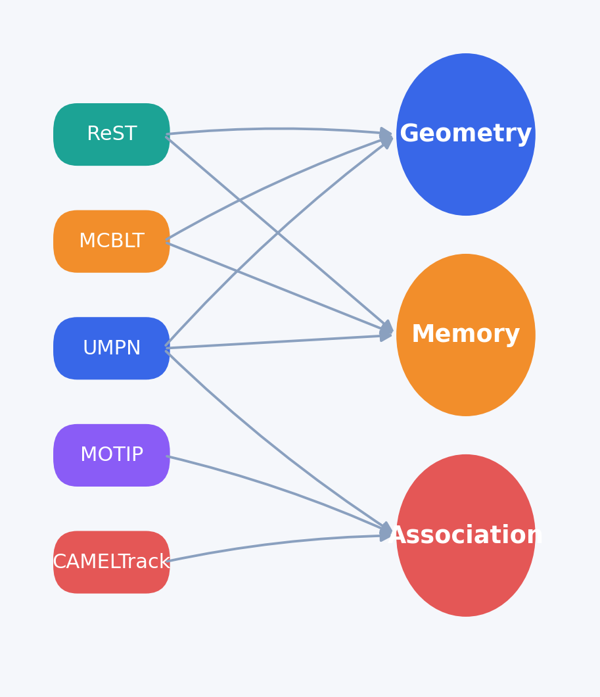

**Source basis:** all five papers. See `slide_sources.md` for page-level mapping.

---

## Slide 2 — Executive synthesis

**Main claim:** the biggest MTMC gains come from **geometry + memory**; the next portable gain comes from **learned association**.

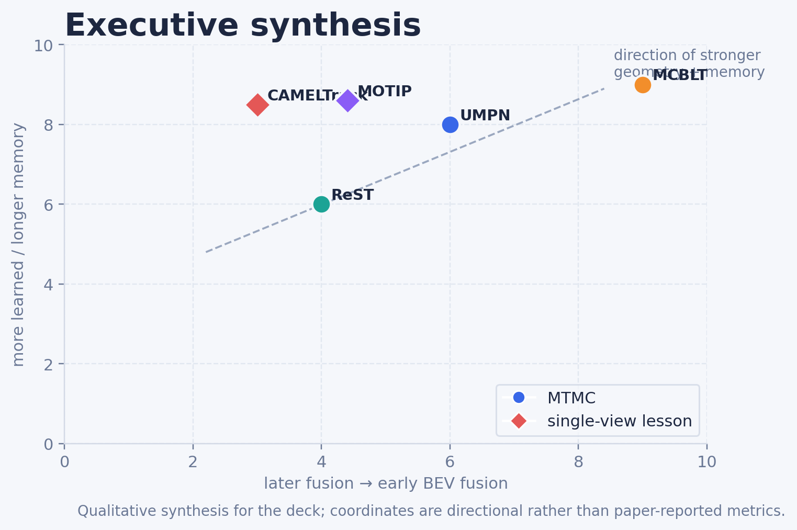

### Compact reading

- **ReST** shows that separating **same-time cross-view association** from **across-time linking** already fixes many fragmented tracklets with modest compute.
- **MCBLT** gets the largest quality jump by moving fusion earlier into **BEV / 3D**, then adding a **global long-term block** for re-entry and long-occlusion handling.
- **UMPN** is the most general online graph formulation here: it unifies single-view and multi-view tracking with one dynamic graph family, and can optionally exploit **scene priors**.
- **CAMELTrack** and **MOTIP** are not MTMC papers, but both show that hand-designed cost fusion can be replaced by **learned association heads**.

### Company takeaway

If the camera network is calibrated and synchronized, invest first in:

1. **world / BEV geometry**
2. **long-term memory**
3. **learned association on top of modular cues**

**Source basis:** ReST pp. 1–12; MCBLT pp. 1–13; UMPN pp. 1–21; CAMELTrack pp. 1–9; MOTIP pp. 1–8. The scatter itself is a qualitative deck synthesis.

---

## Slide 3 — Compact comparison

### Summary table

| paper      | role               | fusion_point                 | association_core                                 | key_reported_result                             | main_takeaway                      |
|:-----------|:-------------------|:-----------------------------|:-------------------------------------------------|:------------------------------------------------|:-----------------------------------|
| ReST       | direct MTMC        | late 2D; current frame first | 2-stage GNN + graph reconfiguration              | 85.7 IDF1 / 81.6 MOTA on WildTrack              | lightweight online baseline        |
| MCBLT      | direct MTMC        | early BEV / 3D               | BEVFormer + hierarchical GNN + global block      | 81.22 HOTA on AICity; 95.6 IDF1 on WildTrack†   | best long-term + 3D reasoning      |
| UMPN       | direct MTMC        | late dynamic graph           | view + temporal + context edges (+ scene priors) | 96.3 IDF1 / 93.9 MOTA on WildTrack              | unified single & multi-view        |
| CAMELTrack | association lesson | cue-level                    | temporal encoders + GAFFE                        | 69.3 HOTA on DanceTrack; 80.4 HOTA on SportsMOT | learn cue fusion, not static costs |
| MOTIP      | association lesson | ID-context                   | transformer ID decoder                           | 72.0 HOTA on DanceTrack; 72.6 HOTA on SportsMOT | association as ID prediction       |

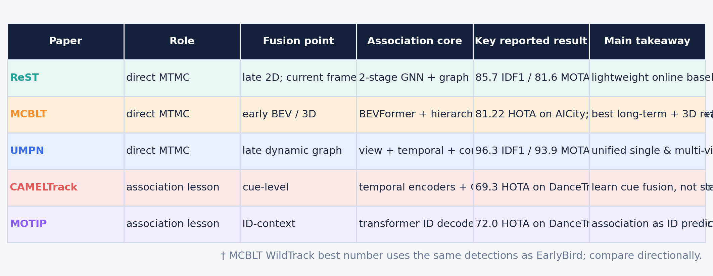

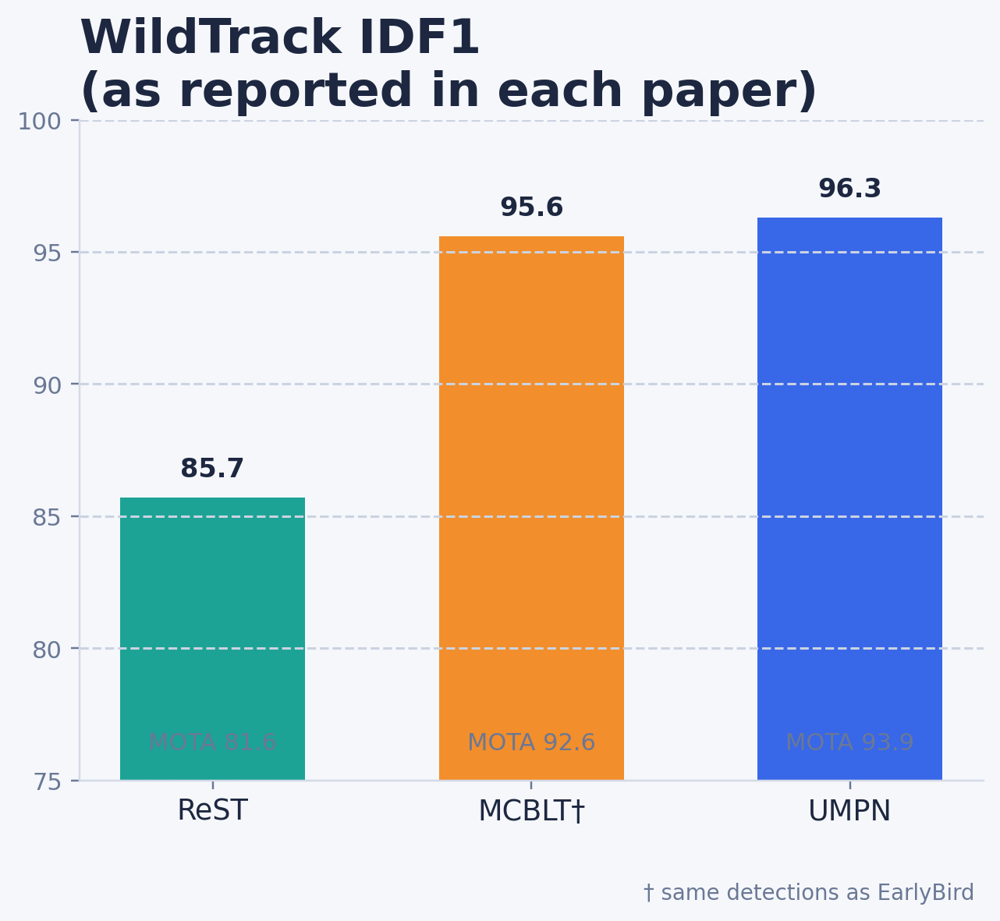

### How to read the comparison

- **MCBLT** is the strongest full-stack MTMC system in this set when overlap is dense and long occlusions matter.
- **ReST** is the leanest online baseline and the easiest starting point for a calibrated deployment.
- **UMPN** is the cleanest “one family for many deployments” design because the same graph machinery spans single-view and multi-view tracking.
- **CAMELTrack** and **MOTIP** matter less for direct MTMC benchmarking and more for what they teach about **association design**.

**Source basis:** ReST p. 7 and pp. 11–12; MCBLT pp. 7–8 and 12–13; UMPN pp. 9–12; CAMELTrack pp. 6–8; MOTIP pp. 6–8.

---

## Slide 4 — Three architectural patterns

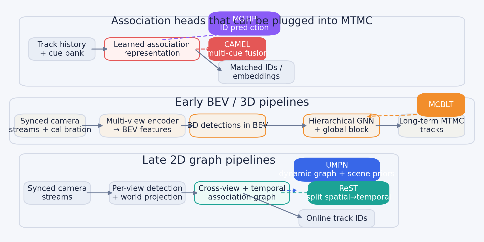

### Pattern A — Late 2D graph

Representative logic: **detector per view → world projection → graph association**

- Lowest adoption barrier
- Works well when calibration is coarse but usable
- Easier to retrofit into an existing single-camera stack

**Best paper match:** ReST  
**Best company use:** fast baseline, online deployment, moderate compute

### Pattern B — Early BEV / 3D

Representative logic: **multi-view feature aggregation before detection / association**

- Strongest option when cross-view ambiguity is the core failure mode
- Better aligned with dense overlap, re-entry, and long occlusion handling
- More expensive and more calibration-sensitive

**Best paper match:** MCBLT  
**Best company use:** high-value sites with stable cameras and dense interactions

### Pattern C — Learned association head

Representative logic: **modular cue bank → learned fusion / ID decoder**

- Replaces brittle cost-weight tuning
- Can sit on top of either a late-graph or BEV-first system
- Especially attractive when the product team already has multiple cues but poor matching quality

**Best paper match:** CAMELTrack + MOTIP  
**Best company use:** upgrade path after the first end-to-end baseline is stable

**Source basis:** ReST pp. 3–6; MCBLT pp. 3–6; UMPN pp. 4–7 and 17–18; CAMELTrack pp. 3–5 and 13–14; MOTIP pp. 3–5.

---

## Slide 5 — ReST: spatial first, temporal second

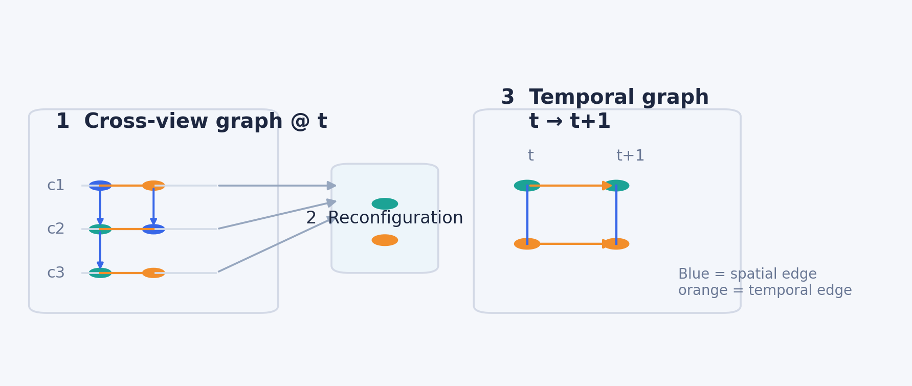

### Why ReST matters

ReST addresses a common MTMC problem: single-camera trackers fragment under occlusion, so any downstream cross-camera association inherits bad tracklets. Its answer is to **associate across cameras first at the current timestamp**, then **reconfigure** that result into a temporal graph for across-time linking.

### Key reported numbers

- **85.7 IDF1** on WildTrack
- **81.6 MOTA** on WildTrack
- **~154K trainable parameters**

### Best fit

Use ReST when you have:

- fixed calibrated cameras
- overlapping fields of view
- online latency requirements
- limited GPU budget relative to 3D-first systems

### Practical lesson for us

Even if we eventually move to a heavier BEV system, ReST’s **stage separation** is a strong design principle:
- do **same-time cross-view merging** explicitly
- then do **across-time identity linking**

That separation is cleaner than asking one opaque matcher to solve both at once.

**Source basis:** ReST pp. 3–8 and 11–12.

---

## Slide 6 — MCBLT: early BEV fusion + global long-term memory

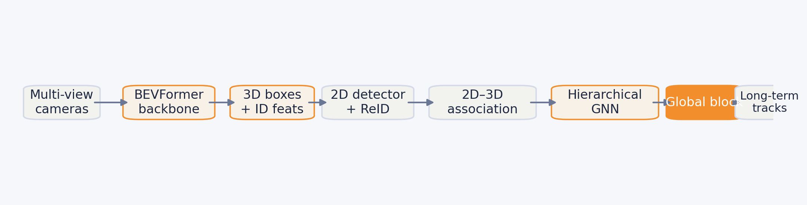

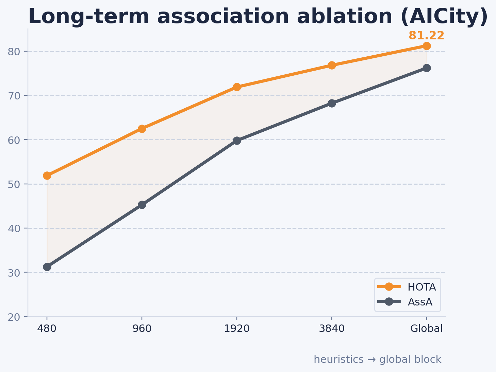

### Why MCBLT matters

MCBLT pushes fusion much earlier than ReST. Instead of detecting separately in each camera and reconciling later, it aggregates synchronized multi-view evidence into a **BEV representation**, generates **3D detections**, and only then performs tracking. This attacks cross-view ambiguity at the source.

### Key reported numbers

- **81.22 HOTA** on AICity’24
- **95.6 IDF1** on WildTrack using the same detections as EarlyBird
- strong long-term association gains from replacing heuristic stitching with a **global block**

### What stands out technically

- **BEVFormer-based multi-view encoder** for early spatial fusion
- **2D–3D association** to attach clean 2D crops / ReID features to 3D tracks
- **Hierarchical GNN + global merging block** for long temporal windows

### Why this is important for a company deployment

If product risk is dominated by:
- occlusion through shelves / walls / people
- re-entry after long disappearance
- identity continuity over very long sequences

then MCBLT-style **geometry-first + memory-first** reasoning is the strongest architecture in this set.

**Source basis:** MCBLT pp. 3–8 and 12–13; exact ablation numbers in Table 5 on p. 8.

---

## Slide 7 — UMPN / One Graph: unify single- and multi-view tracking

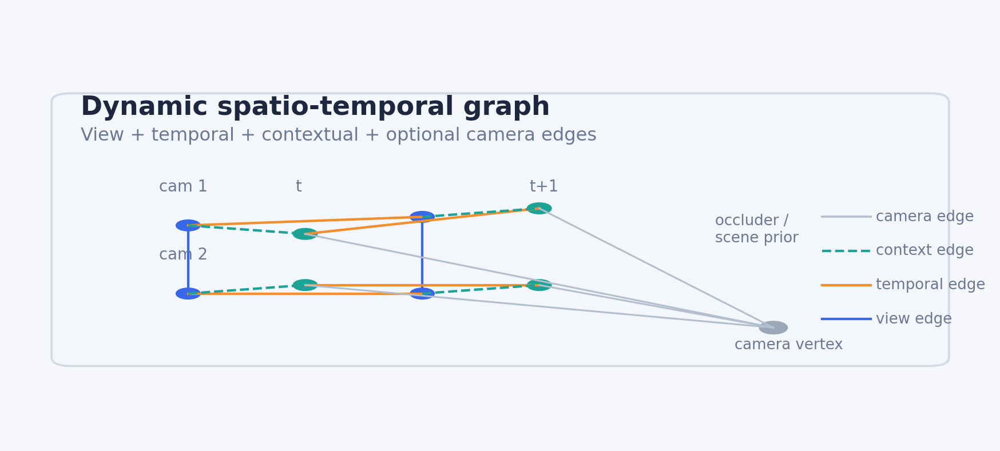

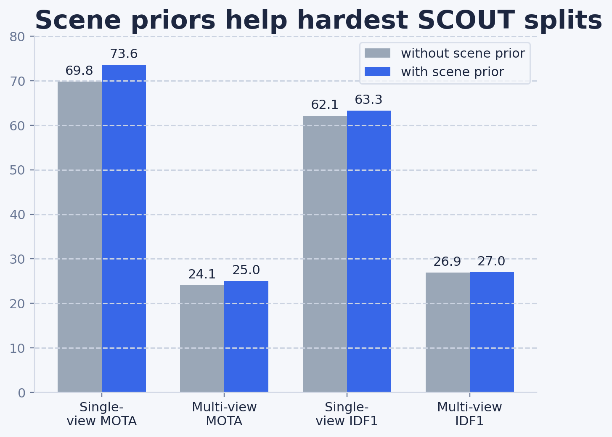

### Why UMPN matters

UMPN builds a rolling online graph with:
- **view edges**
- **temporal edges**
- **contextual edges**
- optional **camera / scene-prior edges**

That makes it the most flexible graph formulation among the papers reviewed here.

### Key reported numbers

- **96.3 IDF1** on WildTrack
- **93.9 MOTA** on WildTrack
- **23 FPS** runtime in the paper’s analysis
- measurable gains on **SCOUT** when scene priors are included

### Where it is strongest

UMPN is the best fit when the company wants one family of models that can cover:
- single-view and multi-view sites
- sites with and without rich scene structure
- online inference with explicit graph reasoning

### Practical lesson for us

UMPN suggests we should not think of scene priors as an optional visualization layer. When site maps, visibility graphs, or occlusion zones are available, they should become **first-class graph inputs**.

**Source basis:** UMPN pp. 4–12 and 17–20; exact SCOUT values in Table 4 on p. 11; runtime in Table 7 on p. 12.

---

## Slide 8 — Association lessons from CAMELTrack + MOTIP

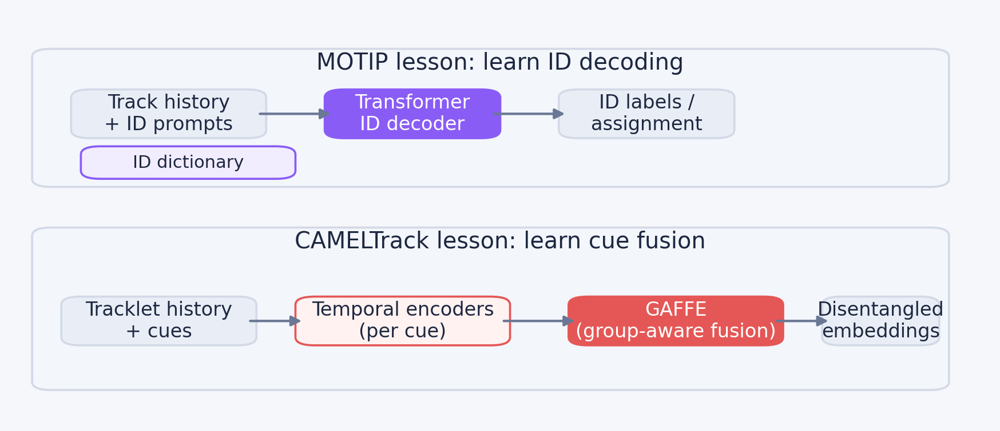

### CAMELTrack lesson

CAMELTrack shows that a modular tracker can remain lightweight while replacing hand-tuned association rules with:
- **Temporal Encoders** for cue-specific history
- **GAFFE** for group-aware multi-cue fusion

What to port into MTMC:
- treat geometry, ReID, visibility, zone, pose, and motion as a **cue bank**
- learn how to weight them by context instead of fixing global cost weights
- create hard synthetic association examples during training

### MOTIP lesson

MOTIP reframes tracking as **ID prediction over track history**.

What to port into MTMC:
- give the matcher an explicit track-history memory
- allow it to predict / decode identity from context instead of only scoring pairwise edges
- use ID prompts or memory tokens to improve long re-entry matching

### Why both matter to MTMC

A company MTMC system often fails not because the features are missing, but because the final matcher is still a brittle stack of hand-tuned thresholds. CAMELTrack and MOTIP are the strongest arguments in this packet for replacing that layer with a learned head.

**Source basis:** CAMELTrack pp. 1–8 and 13–18; MOTIP pp. 1–8.

---

## Slide 9 — Recommended MTMC blueprint for our company

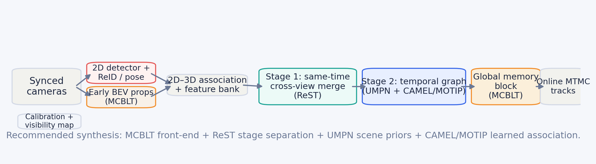

### Recommended synthesis

**Best overall blend from the five papers:**

- **MCBLT front-end** for geometry-first multi-view fusion when calibration quality is good
- **ReST-style stage separation** between same-time cross-view merge and across-time linking
- **UMPN scene-prior edges** whenever site maps / visibility priors exist
- **CAMEL / MOTIP learned association head** instead of static cue fusion

### Five design rules

1. **Track in world / BEV if cameras are calibrated.**
2. **Keep a 2D branch** because it rescues 3D misses and improves ReID crops.
3. **Separate same-time merge from across-time linking.**
4. **Learn cue fusion** instead of tuning cost weights by hand.
5. **Add global memory + visibility priors** for re-entry and long occlusion handling.

### When not to use this full blueprint

If calibration is poor or overlap is limited, start with the simpler **late-graph baseline** and postpone the heavy BEV branch.

**Source basis:** ReST pp. 3–8; MCBLT pp. 3–8 and 12–13; UMPN pp. 4–12 and 17–20; CAMELTrack pp. 3–8 and 13–18; MOTIP pp. 3–8. The blueprint itself is a synthesized deck recommendation.

---

## Slide 10 — Build plan and decision rules

### Suggested implementation path

| phase   | objective              | components                                                          | trigger                                                     |
|:--------|:-----------------------|:--------------------------------------------------------------------|:------------------------------------------------------------|
| Phase 1 | Strong online baseline | Per-view detector + world projection + ReST/UMPN-style online graph | Any calibrated deployment; build evaluation tooling first   |
| Phase 2 | Learned association    | Cue bank + CAMEL/MOTIP-style learned matcher                        | Static weights become the bottleneck or re-entries dominate |
| Phase 3 | BEV / 3D branch        | MCBLT-style early BEV proposals + hierarchical GNN + global block   | Dense overlap, long occlusions, and enough compute          |

### Decision rules

- **Dense overlap + long occlusions** → prioritize early BEV / 3D.
- **Partial overlap or shaky calibration** → start with a late-graph baseline.
- **Edge / real-time deployment** → keep a ReST or UMPN core and add only lightweight learned association.
- **Frequent re-entry / visibility breaks** → invest in global memory and scene priors before tuning more heuristics.
- **If the team is arguing about thresholds** → the matcher probably needs to become learned.

### Bottom line

The wrong optimization target is **“more matcher heuristics.”**  
The right optimization target is **“better geometry, better memory, better learned fusion.”**

**Source basis:** synthesized across all five papers; see `slide_sources.md`.

---

## Slide 11 — Primary citations

See:

- `references.md` for readable citations
- `references.bib` for BibTeX
- `slide_sources.md` for slide-level page references

### Final recommendation in one sentence

Use the **three direct MTMC papers** to choose system architecture, then use **CAMELTrack and MOTIP** to design the association head that sits on top of it.
