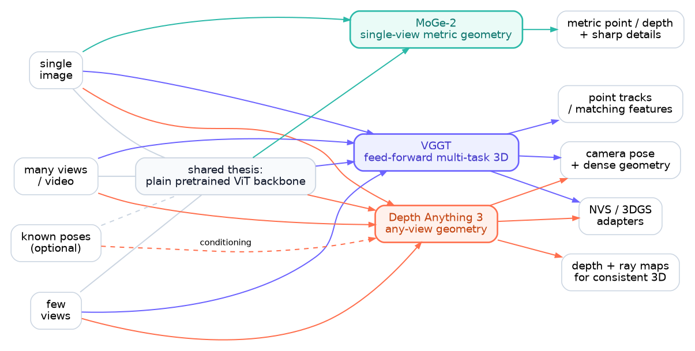
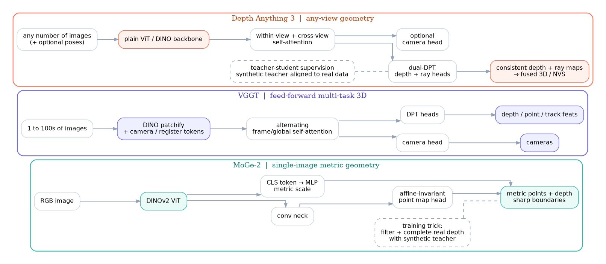
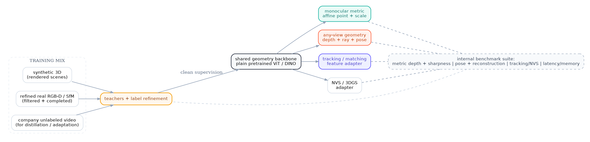

# Vision Foundation Models Review
*Markdown report corresponding to the presentation deck `vision_foundation_models_review.pptx`.*

## Executive overview

Depth Anything 3 (DA3), MoGe-2, and VGGT all point toward the same strategic direction: **strong 3D capability can come from simple ViT-style backbones, if the representation choice and the data recipe are right**. Their main differences are where they place modeling complexity:

- **DA3** bets on a **minimal output target**: depth + rays, with optional camera information, for any-view reconstruction.
- **MoGe-2** bets on **representation decoupling**: keep relative geometry clean, then recover metric scale separately.
- **VGGT** bets on **shared multi-task 3D prediction**: cameras, depth, point maps, and track features from one backbone.

The presentation’s main conclusion is that the best company model should **combine these ideas rather than copy any single paper wholesale**.

## 1. One-slide comparison

| Paper | Input | Representation | Data | Best at | Caution |
| --- | --- | --- | --- | --- | --- |
| MoGe-2 | 1 image | Affine-invariant point map + separate global metric scale | Synthetic + refined real labels | Single-image metric geometry + detail | No many-view reconstruction or track head |
| VGGT | 1 to 100+ images | Cameras + depth + points + tracks from one backbone | Large mixed 3D-annotated sets | Shared 3D backbone | Dedicated point head can be weaker than depth+camera-derived geometry |
| Depth Anything 3 | 1 to N images, posed or unposed | Depth + ray maps (+ optional camera output) | Public academic data + teacher labels | Any-view pose + reconstruction | Heavier training pipeline; non-rigid dynamics remain hard |

### Capability snapshot

| Capability | MoGe-2 | VGGT | DA3 |
| --- | --- | --- | --- |
| Metric monocular geometry | High | Medium | Medium |
| Any-view pose | Low | High | High |
| Tracking / transfer features | Low | High | Medium |
| 3DGS / NVS adapters | Low | High | High |
| Inference simplicity | High | Medium | High |

**Bottom line:** within this three-paper set, **MoGe-2** is the cleanest answer for **single-image metric geometry**, **DA3** is the strongest answer for **any-view reconstruction**, and **VGGT** is the most compelling answer for a **shared multi-output 3D backbone**.

## 2. How the three papers connect

### Convergence

- Large DINO / ViT backbones plus dense heads are now the default recipe.
- Better geometry quality increasingly comes from **better data and supervision**, not only from adding more handcrafted 3D modules.
- All three papers aim to make 3D prediction **feed-forward, scalable, and foundation-model-like**.

### Divergence

- **DA3** argues that a **minimal depth-ray target** is enough for strong any-view geometry.
- **MoGe-2** explicitly **decouples metric scale from relative geometry**.
- **VGGT** uses **multiple auxiliary outputs** to regularize a shared 3D representation.

### Synthesis

- During training, auxiliary outputs are useful **only when they improve the backbone representation**.
- During deployment, the safest outputs are often the **simplest, most calibratable ones**.
- A company model should therefore be **modular at training time, but selective at inference time**.

## 3. Architectures at a glance

### Depth Anything 3

- Accepts **any number of images**, with optional camera poses.
- Uses a **plain pretrained ViT / DINO-style backbone**.
- Adds **input-adaptive cross-view self-attention** so the same backbone can handle variable view counts.
- Predicts **depth + ray maps**, with an optional camera head.

### VGGT

- Accepts **one to hundreds of images**.
- Patchifies inputs, appends camera/register-style tokens, and alternates **frame-wise** and **global attention**.
- Uses a shared backbone with heads for **cameras, dense geometry, and track features**.

### MoGe-2

- Focuses on **single-image metric geometry**.
- Uses a **DINOv2 ViT** with an affine-invariant geometry path.
- Predicts metric scale separately through a **CLS-token MLP head**, then combines the two.

## 4. Depth Anything 3: why it matters

DA3 is the presentation’s strongest signal for **any-view geometry as a product backbone**.

### Key points

- The paper argues that a **single plain transformer** is enough for any-view geometry, without a heavily bespoke 3D architecture.
- Its core output is **depth + ray maps**, which can be fused into consistent geometry and support downstream rendering.
- In the paper’s benchmark, DA3 reports strong gains over VGGT in **camera pose accuracy** and **geometric accuracy**.
- The teacher-student recipe lets DA3 mix public academic datasets while improving supervision density and detail.

### Practical implication

The presentation treats DA3 as the best reviewed template for **multi-view reconstruction, pose estimation, and feed-forward geometry fusion**, especially when the deployment target is broader than monocular depth alone.

## 5. MoGe-2: why it closes the monocular accuracy-detail gap

The most important MoGe-2 lesson is not only the metric head itself, but the **data-cleaning story behind it**.

### Why it works

1. **Representation:** predict affine-invariant geometry first, then recover metric scale with a separate global head.
2. **Data refinement:** use synthetic predictions to filter noisy real depth locally and complete holes in an edge-preserving way.
3. **Outcome:** keep strong geometry while moving much closer to the sharpness usually associated with specialized sharp-depth models.

### Ablation cues highlighted in the presentation

| Finding | Before | After |
| --- | --- | --- |
| Metric depth average rank | 3.83 (Depth Pro) | 1.95 (MoGe-2) |
| Boundary sharpness average rank | 1.50 (Depth Pro) | 1.75 (MoGe-2) |
| Refined real data F1 | 10.3 (raw real) | 12.5 (refined) |

### Practical implication

Even if the final company model is many-view, the presentation recommends reusing **MoGe-2-style scale decoupling** and **real-data refinement**, because those ideas directly improve monocular fallback quality and metric calibration.

## 6. Recommended blueprint for our company model

The central recommendation is to **merge the best ideas** from the three papers:

> **MoGe-2 metric head + DA3 depth-ray geometry + VGGT multi-output reuse**

### Backbone

- One shared **ViT / DINO encoder** with adaptive **1 → N view attention**.
- Multi-resolution training so monocular and multi-view modes share tokens and representations.

### Heads

- **Default inference path**
  - **1 view:** monocular metric head
  - **multi-view:** depth + ray + camera path
- Keep **track** and **NVS / 3DGS** heads as reusable adapters, not necessarily the core production output.

### Data and evaluation

- Build a data engine that mixes:
  - synthetic 3D detail,
  - refined real metric data,
  - public multi-view 3D sets,
  - later, company in-domain capture.
- Evaluate **pose, reconstruction, sharpness, tracking, NVS, latency, and memory together**, not in separate silos.

## 7. Decision matrix and launch checklist

### Decision matrix

| Use case | Default recipe | Why |
| --- | --- | --- |
| Single-image metric perception | MoGe-2-style metric head on shared backbone | Best metric/detail trade-off in the review |
| Sparse unposed multi-view reconstruction | DA3 depth + ray (+ optional camera head) | Strongest pose-free geometry and view scalability among the reviewed papers |
| Track-heavy world model / video understanding | VGGT-style shared track and camera head | Best reusable 3D feature story |
| Edge or real-time deployment | Distilled small/base variants | Keeps the recipe while reducing deployment cost |

### Launch checklist

- Measure **pose AUC, reconstruction F1 / Chamfer Distance, and boundary sharpness** on the same held-out scenes.
- Measure **latency and memory** at **1 / 4 / 12 / 32 views**, not only a single benchmark point.
- Check downstream adapters such as **3DGS / NVS**, **tracking**, and product-specific perception tasks.
- Stress test for **thin structures**, **non-rigid scenes**, **fisheye / panoramic views**, and **large metric-scale ambiguity**.

### Known paper-side failure modes highlighted by the presentation

- Dynamic / non-rigid motion is still a weak spot for feed-forward geometry stacks.
- Very fine structures can still be difficult even when boundary sharpness improves.
- The most appealing benchmark recipe is not automatically the best deployment recipe unless latency, memory, and calibration are measured jointly.

## 8. Overall takeaway

If the goal is to build the **best vision foundation model for the company**, the review recommends:

1. **Use one shared geometry backbone**, not separate monocular and multi-view models.
2. **Adopt MoGe-2’s metric decoupling** for reliable single-image metric perception.
3. **Adopt DA3’s depth + ray formulation** as the default many-view geometry interface.
4. **Keep VGGT-style extra heads** for transfer learning and adapter reuse, but do not force every output into the main inference path.
5. **Treat the data engine as a first-class model component**: refined real labels plus synthetic detail are part of the core recipe, not just supporting infrastructure.

In short: **train broadly, infer selectively, and make geometry calibration a product requirement rather than a benchmark afterthought.**

## References

- **[DA3]** Lin, H., Chen, S., Liew, J. H., Chen, D. Y., Li, Z., Shi, G., Feng, J., & Kang, B. (2025). *Depth Anything 3: Recovering the Visual Space from Any Views.* arXiv:2511.10647.
- **[MoGe-2]** Wang, R., Xu, S., Dong, Y., Deng, Y., Xiang, J., Lv, Z., Sun, G., Tong, X., & Yang, J. (2025). *MoGe-2: Accurate Monocular Geometry with Metric Scale and Sharp Details.* arXiv:2507.02546.
- **[VGGT]** Wang, J., Chen, M., Karaev, N., Vedaldi, A., Rupprecht, C., & Novotny, D. (2025). *VGGT: Visual Geometry Grounded Transformer.* arXiv:2503.11651.

For page-level source pointers used in the report, see `../references/source_evidence.md`.
